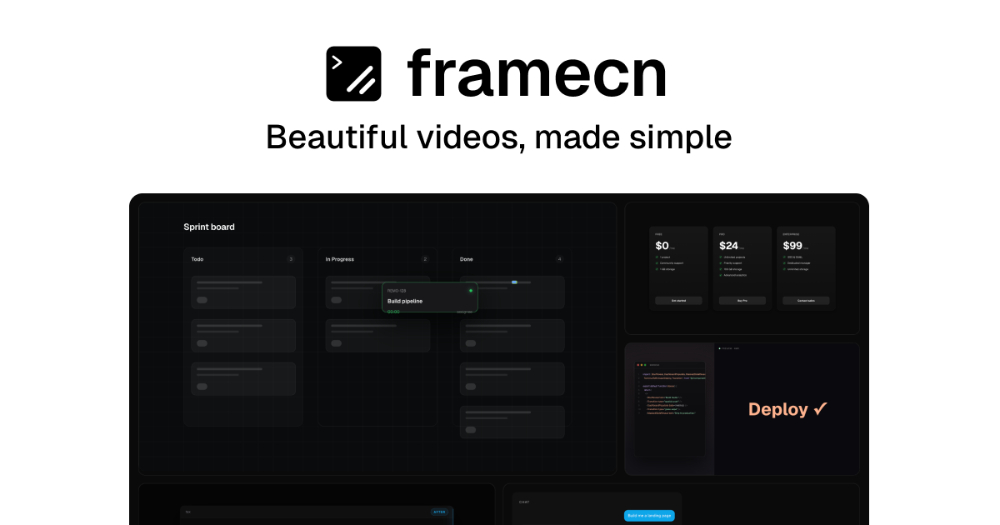

<h1 align="center">framecn</h1>

  Free & open-source, ready-to-use, customizable video components for React. 
  Zero config. One command setup. Built on <a href="https://editframe.com">Editframe</a>, works seamlessly with <a href="https://ui.shadcn.com/">shadcn/ui</a>.

  <a href="https://framecn.dev/docs">Get Started</a> ·
  <a href="https://framecn.dev/docs/installation">Installation</a> ·
  <a href="https://framecn.dev/docs/components">Components</a>

 

  

## Features

- 🎬 **Editframe integration** — Build video compositions with HTML, React, and CSS
- 📹 **Cloud rendering** — Export to MP4 via Editframe's render infrastructure
- 📦 **shadcn/ui compatible** — Uses the same registry format and CLI
- 🧩 **Composable** — Build complex videos with simple, declarative components
- ⏱️ **Timeline control** — Precise timing and sequencing of video elements
- 🎬 **Multi-layer composition** — Stack videos, images, text, and effects
- 🤖 **AI-ready** — Perfect for generating videos programmatically

## Contributing

Contributions are welcome! Please feel free to submit a Pull Request.

1. Fork the repository
2. Create your feature branch (`git checkout -b feature/amazing-feature`)
3. Commit your changes (`git commit -m 'Add some amazing feature'`)
4. Push to the branch (`git push origin feature/amazing-feature`)
5. Open a Pull Request

## Credits

- [remocn](https://github.com/kapishdima/remocn) by [Kapish Dima](https://github.com/kapishdima)

## License

[MIT](LICENSE)

## Star History

<a href="https://www.star-history.com/?repos=shadcn-labs%2Fframecn&type=date&legend=top-left">
 <picture>
   <source media="(prefers-color-scheme: dark)" srcset="https://api.star-history.com/chart?repos=shadcn-labs/framecn&type=date&theme=dark&legend=top-left" />
   <source media="(prefers-color-scheme: light)" srcset="https://api.star-history.com/chart?repos=shadcn-labs/framecn&type=date&legend=top-left" />
   
 </picture>
</a>
